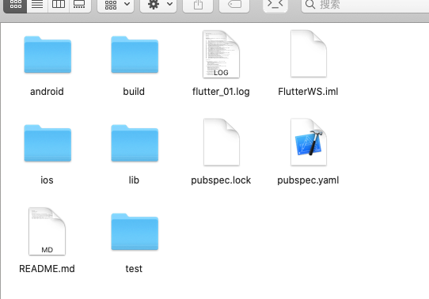
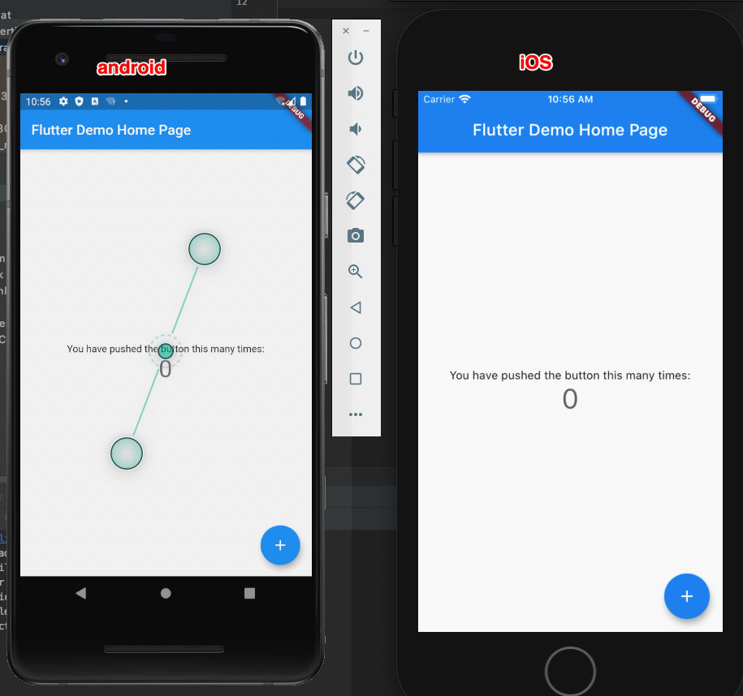

# Flutter

## 1、下载
下载flutter
https://github.com/flutter/flutter.git

## 2、设置环境变量
open .bash_profile
```
export ANDROID_HOME=/Users/wlxk/Library/Android/sdk
export PATH=${PATH}:${ANDROID_HOME}/tools
export PATH=${PATH}:${ANDROID_HOME}/platform-tools

export PUB_HOSTED_URL=https://pub.flutter-io.cn
export FLUTTER_STORAGE_BASE_URL=https://storage.flutter-io.cn
#下面这行要替换成自己 flutter下载的路径
export PATH=/Users/wlxk/LocalWorkspace/Github/Flutter/flutter/bin:$PATH 
```
## 3、安装其他（as 的插件和 cocoapods）
Android：
打开 Android Studio 安装 Flutter 与 Dart 语言插件，
iOS：
安装cocoapods 命令行安装：sudo gem install cocoapods
查看教程：https://www.jianshu.com/p/dbfdece084d5

## 4、hello wolrd工程运行
命令行新建一个flutter工程：flutter create .

运行 flutter run 然后选择一个模拟器

### 4.1 ios
打开ios目录下的工程文件 运行即可（要在运行flutter run之后）
### 4.2 android
打开android目录下的Android 工程 运行即可

