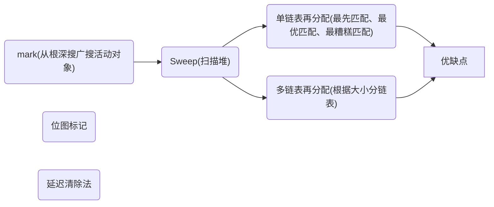

# 《垃圾回收的算法与实现》第2章GC标记-清除算法

## 垃圾回收系列连载：

------
1. 第 1 章 学习GC之前
2. 第 2 章 GC标记-清除算法
3. 第 3 章 引用计数法
4. 第 4 章 GC复制算法
5. 第 5 章 GC标记-压缩算法
6. 第 6 章 保守式GC
7. 第 7 章 分代垃圾回收
8. 第 8 章 增量式垃圾回收
9. 第 9 章 RC Immix 算法
10. 第 10 章 Python 的垃圾回收
11. 第 11 章 DalvikVM 的垃圾回收
12. 第 12 章 Rubinius 的垃圾回收

[电子书下载链接](https://github.com/wlxklyh/book/blob/master/Book/GC/%E5%9E%83%E5%9C%BE%E5%9B%9E%E6%94%B6%E7%9A%84%E7%AE%97%E6%B3%95%E4%B8%8E%E5%AE%9E%E7%8E%B0---.pdf)

------

## 第 2 章 GC标记-清除算法
一图总结文章内容

### 什么是GC标记-清除法
标记清除法是一种找到垃圾的方法，就是分成两个步骤，标记和清除，标记是从根部除法做搜索，经过的则标记，清除是从堆遍历 找到没有使用则清除。

### 标记阶段
标记使用什么搜索方式呢？广度搜索、深度搜索，这个过程是要中断对象操作的，不中断的话，新生成的对象 就可能不可达。

### 清除阶段
在清除阶段，我们使用变量 sweeping 遍历堆，具体来说就是从堆首地址 $heap_start 开始，按顺序一个个遍历对象的标志位。
### 分配阶段
这里的分配是指将回收的垃圾进行再利用。遍历 $free_list，寻找合适的 size 的分块就是分配阶段。
First -fit、Best -fit、Worst -fit 的不同：

### 碎片合并
前文中已经提过，根据分配策略的不同可能会产生大量的小分块。但如果它们是连续的， 我们就能把所有的小分块连在一起形成一个大分块。这种“连接连续分块”的操作就叫作合 并(coalescing)，合并是在清除阶段进行的。
### 优点
1. 实现简单
2. 与保守式 GC 算法兼容
### 缺点
1. 碎片化
2. 分配速度
3. 与写时复制技术不兼容 进程 fork 节省内存的方法
### 多个链表的空闲表
利用分块大小不同的空闲链表，即创建只连接大分块的空 闲链表和只连接小分块的空闲链表。

### BiBOP
将大小相近的对象整理成固定大小的块进行管理的做法

### 延迟清除
**个人对这里有新理解：** 所有的对象，一旦对象不在根部有引用，那么这个对象就不可能再被引用，标记后，没有被标记的对象一定是非活动对象了，但是新产生的对象再后续的发展中 可能成为非活动对象也可能成为非活动对象，那么这些新对象都标记不能被清除，因此没有标记的对象是可以延迟清除的，不会再次被标记。但是要注意新对象都要标记。

### 请期待 “第 3 章 引用计数法”
