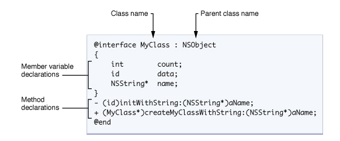

## 基础入门
https://www.runoob.com/w3cnote/objective-c-tutorial.html

### 1、文件扩展
.h 头文件
.m 源代码文件
.mm 源代码文件

### 2、消息传递
C++：一个方法必定属于一个类  编译时 就紧密绑定
obj.method(arg)
oc：类别和消息松散 调用方法是为对对象发送消息 如果收到一个无法处理的消息 
[obj method:arg];

如果obj没有method是可以编译过的  但是运行时有异常。这样的特性让oc天生具备动态绑定能力 C++则要用virtual  
obj如果是nil也不会奔溃

### 3、字符串
@"hello world" 这是一个NSString

### 4、类
oc的类包含：定义、实现。
类的实现总是由@interface 编译选项开始 @end编译选项结束，类的变量声明在大括号包含的代码里面 实例变量块后面就是类声明的方法的列表 每个方法分号结束。


### 5、Interface
```objective-c
@Interface MyObject：NSPbject
{
    int test;
}

+(return_type) class_method;//类方法

-(return_type) instance_method1:(int) p1:(int) p2;//实例方法
```

### 6、方法调用
```
-(void) setColorToRed:(float)red Green:(float)green Blue:(float)blue;
[myColor setColorToRed:1.0 Green:0.5 Blue:0.2]
```

### 7、Implementation
@Implementation开始 @end结束

```
@Implementation MyObject
{
    int member;//私有变量
}
+(return_type) class_method
{
    //method implementation
}
-(return_type) instance_method1
{

}

```

### 8、创建对象
```
MyObject *my = [[MyObject alloc] init];
或
MyObject *my = [MyObject new];//无参数的语法精简
重写init 方法类似于C++的构造函数
```

### 9、方法
类方法：用做创建新的类实例的工厂方法

### 10、属性
属性不会创建实例变量 仅仅只是定义方法访问已有的实例变量的速记方式而已。属性可以代替getter setter。
属性可以暴露“虚拟”变量 不保存在实例变量中。
属性声明放在类接口的方法声明那里  @property NSString*name;
copy  readonly
如果是@systhesize 那么自动生成一堆访问方法 
如果是@dynamic 需要程序员手动提供
属性可以利用传统的消息表达式
Person *aPerson = [[Person alloc] initWithAge:53];
类或协议的属性 可以被动态读取.

### 11、快速枚举
```
NSEnumerator *enumerator
```

### 12、协议
协议是一组没有实现的方法列表
非正式协议
正式协议 ：类似于java的接口  Optional可选的
```
@protocol Locking
-(void) lock;
-(void) unlock;

@interface SomeClass:SomeSuperClass <Locking>

```


### 13、动态类型
一个对象收到消息后三种处理
1、回应 然后运行方法
2、无法回应 转发给其他对象
3、抛出异常

### 14、转发 ??
```
-(retval_t) forward:(SEL) sel:(arglist_t) args;
```

### 15、类别(Category)

### 16、垃圾收集？？
