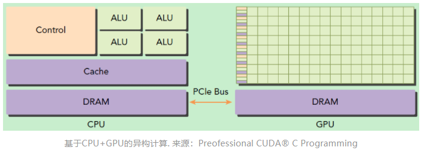
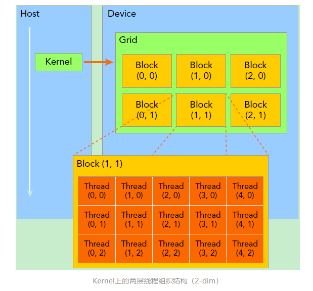
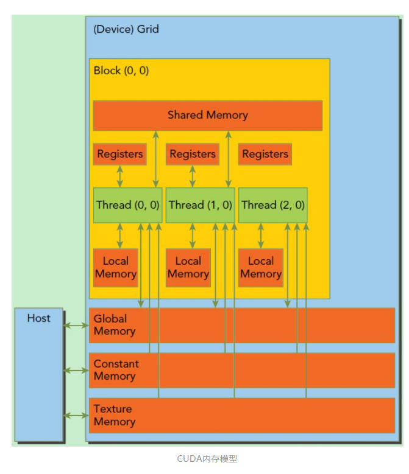

# 初识CUDA

## 概括
CUDA就是NVIDIA给的开发者调用的工具，使得程序可以使用GPU来做计算。

## 环境
安装教程：
https://blog.csdn.net/chengyq116/article/details/105919991

旧版本下载：
https://developer.nvidia.com/cuda-toolkit-archive

样例：
https://developer.nvidia.com/cuda-code-samples

简单教程：
https://zhuanlan.zhihu.com/p/34587739

## 1、cuda可以做什么
CPU处理逻辑复杂的串行程序 GPU负责处理数据密集的并行计算。

## 2、CUDA编程基础
CUDA是个异构模型 CPU GPU协同工作。CUDA中 host和device是两个重要概念。host理解为CPU和内存 device理解为GPU和显存
执行流程：
1、分配host内存 数据初始化
2、分配device内存 并从host拷贝到device
3、调用CUDA的核函数在device完成运算
4、将device的运算结果拷贝到host上
5、释放device和host上分配的内存

这里区分__global__ __device__ __host__ 三种函数，一个kernel启动的所有线程称之为grid 同一个grid共享相同的全局内存空间。
2-dim线程组织 grid和block都是dim3 

- 一个线程块是放在同一个流式多处理器SM 现代GPU的线程块可支持的线程数可达到1024 

CUDA内存模型

## 3、cuda 显存OOM
