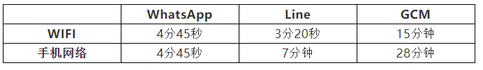
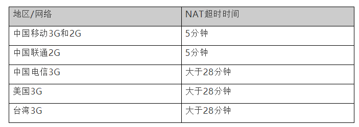

#  
<!-- TOC -->

- 
    - [一、主要目标](#%E4%B8%80%E4%B8%BB%E8%A6%81%E7%9B%AE%E6%A0%87)
    - [二、每个APp分析](#%E4%BA%8C%E6%AF%8F%E4%B8%AAapp%E5%88%86%E6%9E%90)
        - [WhatsApp](#whatsapp)
        - [Line](#line)
            - [、美国 使用GCM  半小时](#%E7%BE%8E%E5%9B%BD-%E4%BD%BF%E7%94%A8gcm--%E5%8D%8A%E5%B0%8F%E6%97%B6)
            - [、国内 不使用GCM](#%E5%9B%BD%E5%86%85-%E4%B8%8D%E4%BD%BF%E7%94%A8gcm)
        - [微信](#%E5%BE%AE%E4%BF%A1)
        - [心跳经验值](#%E5%BF%83%E8%B7%B3%E7%BB%8F%E9%AA%8C%E5%80%BC)
        - [各个App的策略的优点](#%E5%90%84%E4%B8%AAapp%E7%9A%84%E7%AD%96%E7%95%A5%E7%9A%84%E4%BC%98%E7%82%B9)
        - [各个App的策略的不足](#%E5%90%84%E4%B8%AAapp%E7%9A%84%E7%AD%96%E7%95%A5%E7%9A%84%E4%B8%8D%E8%B6%B3)
    - [三、GCM研究](#%E4%B8%89gcm%E7%A0%94%E7%A9%B6)
        - [2](#2)
        - [3](#3)
        - [GCM Server类型](#gcm-server%E7%B1%BB%E5%9E%8B)
    - [四、微信改进的点](#%E5%9B%9B%E5%BE%AE%E4%BF%A1%E6%94%B9%E8%BF%9B%E7%9A%84%E7%82%B9)
        - [影响TCP链接寿命的因素](#%E5%BD%B1%E5%93%8Dtcp%E9%93%BE%E6%8E%A5%E5%AF%BF%E5%91%BD%E7%9A%84%E5%9B%A0%E7%B4%A0)
            - [NAT超时](#nat%E8%B6%85%E6%97%B6)
            - [DHCP租期](#dhcp%E7%A7%9F%E6%9C%9F)
            - [网络状态变化](#%E7%BD%91%E7%BB%9C%E7%8A%B6%E6%80%81%E5%8F%98%E5%8C%96)
    - [一、移动网络特点](#%E4%B8%80%E7%A7%BB%E5%8A%A8%E7%BD%91%E7%BB%9C%E7%89%B9%E7%82%B9)

<!-- /TOC -->

## 一、主要目标
根据网络类型自适应的找出保活信令TCP链接的尽可能打的心跳间隔 从而减少安卓微信因心跳引起的空中信道资源消耗 减少心跳server负载 减少心跳引起的耗电

## 二、每个APp分析

### WhatsApp 
不支持GCM 心跳间隔4分45秒  心跳5次后主动断开链接再重连
支持GCM GCM 10分钟

### Line

#### 、美国 使用GCM  半小时

#### 、国内 不使用GCM 
长链接+心跳  wifi是3分20秒心跳间隔  手机网络是7分钟
轮询  客户端建立长链接后会定时发送请求 server会恢复并且同事关闭长链接  客户端等待轮询时间间隔T1后再次建立TCP链接 Line会根据手机活跃状态动态调整T1  调整范围是从最小1分到最大到2小时半  长链接存活时间T2比较固定 在WIFI下4分钟 手机网络7分钟

### 微信
微信没有使用GCM，自己维护TCP长连接，使用固定心跳。

### 心跳经验值

### 各个App的策略的优点
a)微信 心跳间隔短 新消息提醒及时
b)使用GCM：省电
c)Line:轮询

### 各个App的策略的不足
a)微信 耗电 耗流量
b)使用GCM：运营商NAT策略不同 GCM频繁断连
c)Line:轮询延迟
d)

## 三、GCM研究
a)android 2.2以下不支持GCM 2.2到3.0要安卓Google store并设置账号  4.04以上不设置账号也可以支持
b)GCM只能传递小于4kb数据 对这些数据的处理可以完全由开发者控制
c)android应用不需要运行就可以接收消息
d)GCM不保证发送消息的顺序 也不保证消息一定能推送到手机

### 2
a)用心跳保活 心跳间隔wifi15分钟 数据网络28分钟
b)Google可以改变素有Android设备的心跳间隔
c)间隔小于运营商NAT间隔  导致断开

### 3
a)厂商去掉GCM
b)android 2.2-3.0要装google store和登录
c)国内2G 移动3GNAT小于28分钟  导致不能保活
d)某些运营商限制5228端口  

### GCM Server类型
a)http server
b)XMPP server

## 四、微信改进的点
a)公共push通道
b)使用GCM push作为辅助
c)自适应心跳间隔

### 影响TCP链接寿命的因素

#### NAT超时
国内很重要  测算NAT超时时间

#### DHCP租期
安卓再DHCP到期不会主动续约 会继续使用过期IP

#### 网络状态变化
手机网络和wifi网络切换 网络断开 连上
1、前后台区分处理 前台用固定心跳保证体验 进入后台先使用最小的心跳 然后进入后台自适应计算
2、后台自适应心跳选择区间

## 一、移动网络特点
1）高时延 易抖动丢包 通道狭窄
2）接入类型和接入点变化频繁
3）高频 碎片

链路长容易丢包
信道收回
