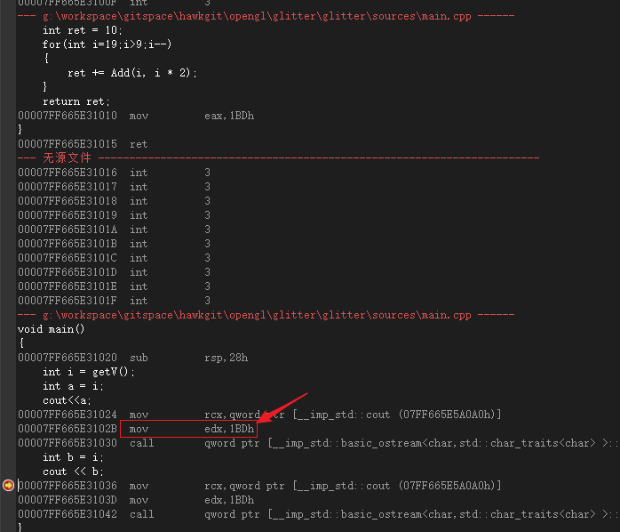
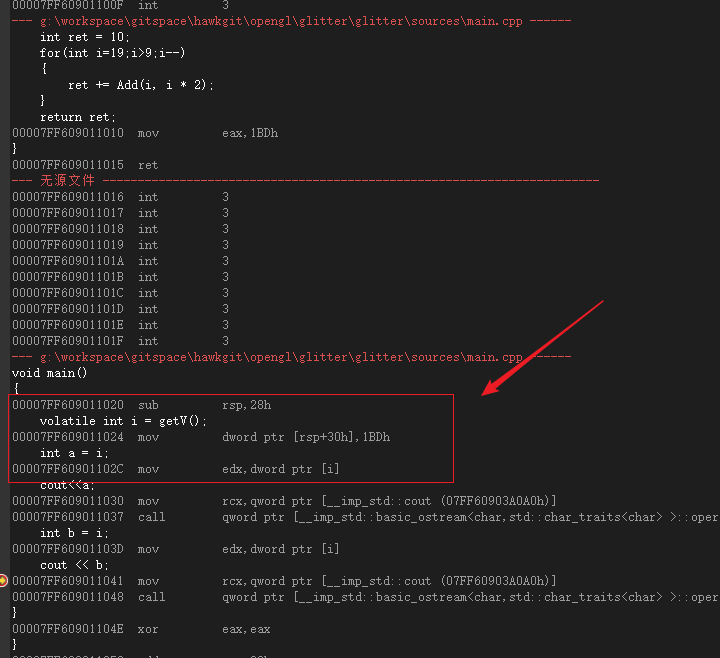

# 目录

<!-- TOC -->

- [目录](#目录)
  - [零、开源项目](#零开源项目)
    - [软渲染器](#软渲染器)
      - [1 UE4工程](#1-ue4工程)
      - [2 Unity工程](#2-unity工程)
      - [3 Android工程 【TODO】](#3-android工程-todo)
  - [一、知识](#一知识)
    - [C++](#c)
    - [内存池](#内存池)
    - [算法](#算法)
    - [设计模式](#设计模式)
    - [安卓](#安卓)
    - [SQLite](#sqlite)
    - [](#)
    - [计算机网络](#计算机网络)
    - [项目经历](#项目经历)
  - [二、书籍](#二书籍)
    - [计算机网络](#计算机网络-1)
      - [《图解http》](#图解http)
    - [GC回收](#gc回收)
      - [《垃圾回收的算法和实现》](#垃圾回收的算法和实现)

<!-- /TOC -->

## 零、开源项目
### 软渲染器 
#### 1 UE4工程 
给UE Programmer或者C++ Programmer 想了解图形学、渲染管线的coder
渲染一个正方体的效果

UE4工程：https://github.com/wlxklyh/SoftRenderer/tree/master/Unreal
主代码和注释：https://github.com/wlxklyh/SoftRenderer/blob/master/Unreal/Source/Graphic/SoftRenderer/ScreenDevice.h


#### 2 Unity工程 
给Unity Programmer或者C# Programmer 想了解图形学、渲染管线的coder
渲染一个正方体的效果

工程：https://github.com/wlxklyh/SoftRenderer/tree/master/Unity
主代码和注释：https://github.com/wlxklyh/SoftRenderer/blob/master/Unity/Assets/MainCode.cs


#### 3 Android工程 【TODO】
给Android Programmer或者Java Programmer 想了解图形学、渲染管线的coder

##  一、知识

### C++
- Volatile作用
类型修饰符 没有使用这个声明的 可能直接从CPU的寄存器里面直接取值 下面b=i的汇编会直接从寄存器里面读取值

变量i 没有关键字Volatile 那么是有编译器优化 1BDh直接把这个值算好在汇编里面



变量i 有关键字Volatile 那么是无编译器优化 


- 虚函数
1. 构造函数可以是虚函数吗？
不可以 因为调用虚函数的时候还没构造完这个对象 也就虚指针还没创建好 无法调用
2. 构造函数中调用虚函数会如何？
```Cpp
class A
{ 
    A(){fun()};
    virtual void fun(){cout<<"A fun"}
}
class B:public A
{
    B(){};
    virtual void fun(){cout<<"B fun"}
}
```
A的构造函数调用虚函数  输出的是A Fun  先调用A构造函数时输出 再调用B构造函数
析构函数调用顺序是先子类 后基类  虚函数的多态也会失效，虚表是在构造函数赋值的 基类构造所先赋值了基类的虚表 所以调用的是基类的虚函数  虚函数多态也就失效了虚表在构造基类 子类时绑定
3. 析构函数能够是虚函数
建议是因为 基类指针析构调用才可以调用到子类的析构函数 不然只调用基类的析构 没有调用子类析构从而子类内存泄露

4. 虚函数实现原理？虚表
    1. 同个类的所有对象的虚表是一样的 虚指针指向的地址一样 是同一张虚表
    2. 多继承才有多个虚指针
    3. 
```cpp
class A(){virtual Afun()}
class B(){virtual Afun()}
sizeof(B) = 4

class A(){virtual Afun()}
class B(){virtual Bfun()}
sizeof(B) = 4 为什么呢？
```

- 智能指针
 
### 内存池
[链接](https://github.com/wlxklyh/book/blob/master/interview/%E5%86%85%E5%AD%98%E6%B1%A0/Main.md)
1. 见过的方式
- 对象的内存池：下面的例子，重载new 和 delete 对象池的内存池
- 内存块的内存池：自己定义PoolMalloc 和 PollFree函数 业务用这两个接口

2. 最简单的对象池内存池
```cpp
#include <iostream>
using namespace std;

// 下图的解释
// 1、每次没有的时候都会申请MemBlock 一个大块的内存 占据3个对象
// 2、申请了第7次的时候又触发了Block的内存申请 导致0-6都在被使用 有3个Block
// 3、Free了FreeNode4 然后FreeNode4 ->next = FreeNode7
// 4、Free了FreeNode1 然后FreeNode1 ->next = FreeNode4
// 5、Free链表 则是 FreeNode1 -> FreeNode4 -> FreeNode7 -> FreeNode8
//
//
//			MemBlock2				MemBlock1			MemBlock0
//          +---------------+     +--------------+	   +--------------+
//          |               |     |              |	   |              |
//   +------+  FreeNode6    |     |  FreeNode3   |	   |  FreeNode0   |
//   |      |               |     |              |	   |              |
//   |      +---------------+     +--------------+	   +--------------+
//   +----->+               |     |              |	   |              |
//          |  FreeNode7    <-----+  FreeNode4   <-----+  FreeNode1   |
//   +------+               |     |              |	   |              |
//   |      +---------------+     +--------------+	   +--------------+
//   +------>               |     |              |	   |              |
//          |  FreeNode8    |     |  FreeNode5   |	   |  FreeNode2   |
//          +               |     |              |	   |              |
//          +---------------+     +--------------+	   +--------------+
```
### 算法

### 设计模式
- 6大原则 开闭原则 扩展开放 修改封闭
1. 单一原则 每个类负责的职责单一 不要耦合很多的功能
2. 依赖倒转 抽象不依赖细节 细节不依赖抽象 
3. 里氏替换 任何基类出现的地方 子类都可以出现 子类对父类的方法尽量不要重写重载 
4. 迪米特原则：两个类不相关 用第三方来通信
5. 接口隔离：接口拆分
6. 合成复用：尽量用合成聚合 而不是继承
https://www.zhihu.com/market/pub/119564625/manuscript/1102535948868382720

- 工业生产的经验
1. 尽可能用组合而不是继承： 这样可以代码复用
2. 继承不要多于两层：  这样会很复杂 而且做复用 可能会更改父类和子类 不好维护


- 23设计模式
1. 工厂模式：
### 安卓
- 双亲委托 
ClassLoader会向上找加载  如果父类可以加载则加载了 不行再子类加载

- 四种热更新方案：
1. 阿里AndFix：基于native hook在java虚拟机层面hook函数
2. 美团Robust：基于插桩 编译的时候会加入插桩代码
3. tinker:dex差异合并
4. QQ空间：反射得到dexElements 然后插入下发的修复dex （某个类的调用都在dex则会有个标记 使用的时候校验如果调用了其他dex则异常 解决就是单独的hack.dex 其他dex都去调用下）

- activity的四种启动方式
1. standard 每次新增
2. singleTop 清理栈顶 
3. singleTask 
4. SingleInstance

### SQLite
- SQLite底层使用B+tree
###  


### [计算机网络](https://github.com/wlxklyh/book/blob/master/interview/neiwork/Main.md)

### 项目经历

## 二、书籍

### 计算机网络

#### [《图解http》](https://github.com/wlxklyh/book/blob/master/Book/GC/Main.md)

### GC回收

#### [《垃圾回收的算法和实现》](https://github.com/wlxklyh/book/blob/master/Book/neiwork/Study.md)
