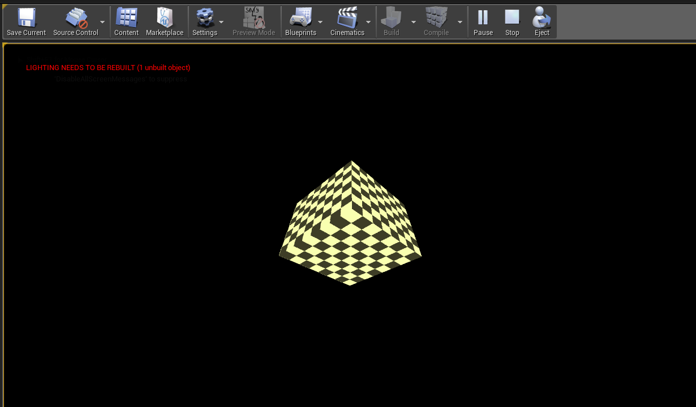
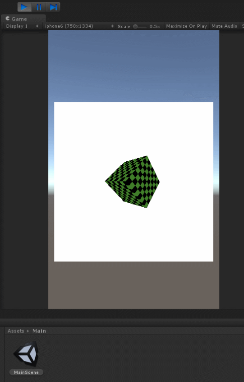
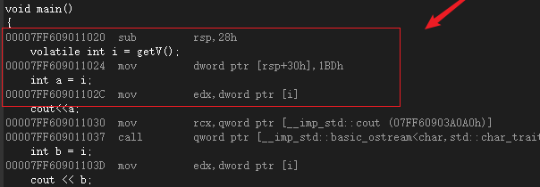
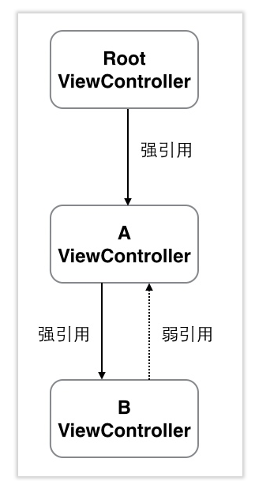
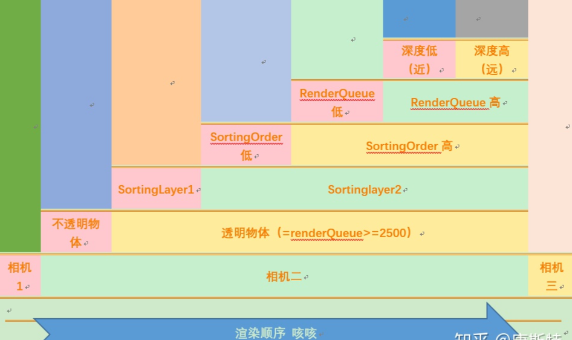
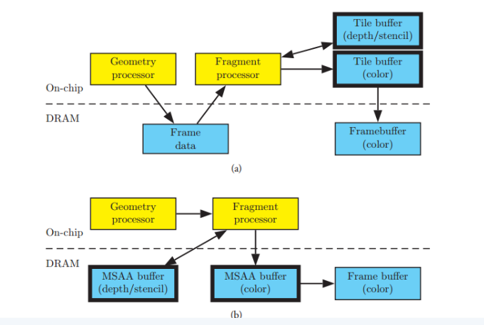
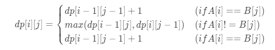

# 目录
    
<!-- TOC -->

- [目录](#目录)
  - [当前计划](#当前计划)
  - [零、开源项目](#零开源项目)
    - [1、软渲染器](#1软渲染器)
      - [1.0. 说明](#10-说明)
      - [1.1 UE4 下载即可运行的工程](#11-ue4-下载即可运行的工程)
      - [1.2 Unity 下载即可运行的工程](#12-unity-下载即可运行的工程)
      - [1.3 Android工程 【TODO】](#13-android工程-todo)
      - [1.4 iOS工程 【TODO】](#14-ios工程-todo)
    - [2. FFMpeg入门教程](#2-ffmpeg入门教程)
    - [软渲染器渲染引擎（TODO）](#软渲染器渲染引擎todo)
    - [Opengl Glitter开源学习（TODO）](#opengl-glitter开源学习todo)
  - [一、知识](#一知识)
    - [js](#js)
    - [Lua](#lua)
    - [C++](#c)
    - [Object-c](#object-c)
    - [内存池](#内存池)
    - [设计模式](#设计模式)
    - [安卓](#安卓)
    - [SQLite](#sqlite)
    - [图形学](#图形学)
    - [音视频流](#音视频流)
    - [计算机网络](#计算机网络)
    - [项目经历](#项目经历)
    - [编程](#编程)
  - [二、书籍](#二书籍)
    - [计算机网络](#计算机网络-1)
      - [《图解http》](#图解http)
    - [GC回收](#gc回收)
      - [《垃圾回收的算法和实现》](#垃圾回收的算法和实现)
  - [三、面试总结](#三面试总结)
    - [对项目框架的认识 总体把握](#对项目框架的认识-总体把握)
    - [对问的问题可以提出疑问 有什么限定有什么场景](#对问的问题可以提出疑问-有什么限定有什么场景)
    - [wshr](#wshr)
  - [四、其他](#四其他)
    - [Markdown](#markdown)

<!-- /TOC -->


## 当前计划
|序号|计划名字|当前进度|资源链接|
|-|-|-|-|
|1|《Object-C基础教程》||[pdf 已购 ](https://github.com/wlxklyh/book/blob/master/Book/ObjectC/Objective-C%E5%9F%BA%E7%A1%80%E6%95%99%E7%A8%8B.pdf)|
|2|《从0开发一款iOS App》||[付费视频](https://time.geekbang.org/course/detail/100025901-93482)|
|3|《Runoob——Swift 教程》||[博客教程](https://www.runoob.com/swift/swift-tutorial.html)|
|4|《ios开发进阶》||[pdf 已购](https://github.com/wlxklyh/book/blob/master/Book/ObjectC/%E3%80%8AiOS%E5%BC%80%E5%8F%91%E8%BF%9B%E9%98%B6%E3%80%8B%E5%94%90%E5%B7%A7_%E5%B8%A6%E4%B9%A6%E7%AD%BE%E7%9B%AE%E5%BD%95.pdf)|
|5|维护博客|||
|6|《Shader入门精要》|||
|7|《LearnOpengl》|||
|8|重温《垃圾回收的算法和实现》|||

## 零、开源项目


|序号|项目名字|简介|github链接|
|-|-|-|-|-|
|1|个人知识脉络|**记录了看过的书、开源的项目、计算机知识脉络。**| []((https://github.com/wlxklyh/book)) []((https://github.com/wlxklyh/book))|
|2|各平台软渲染器|**零基础入门渲染管线（android开发者、ios开发者、Unity开发者、UE开发者）**|[]((https://github.com/wlxklyh/SoftRenderer)) []((https://github.com/wlxklyh/SoftRenderer))|
|3|FFMpeg入门教程|**零基础入门FFmpeg（懂C++即可，下载可运行）**|[]((https://github.com/wlxklyh/FFMpegStudy)) []((https://github.com/wlxklyh/FFMpegStudy))|


### 1、软渲染器 
#### 1.0. 说明
如果将一个正方体Mesh8顶点（每个顶点包含顶点坐标、UV坐标、color）在CPU侧做坐标转换、光栅化然后得到一张显示正方体的图片，这个过程用Opengl、dx就是调用几个接口就可以实现是用GPU渲染出来，软渲染器则是在CPU模拟GPU流水线来渲染到CPU的一个二维像素数组上。

步骤：
1. 一个立方体分解为画8个面：索引的知识  用索引节省内存 内存和显存
2. 一个面分解为2个三角形：每个三角形初始化的是模型空间的坐标
3. 一个三角形绘制前要更新MVP矩阵：
   1. Transform的旋转矩阵 等于X Y Z旋转矩阵乘法（用四元素效果更高）Transform的位移矩阵、缩放矩阵scale
   2. View矩阵：GetLookAtMat(camera相机位置,at相机看的位置,up)
      // Rx Ry Rz 0
      // Ux Uy Uz 0
      // Dx Dy Dz 0
      // 0  0  0  1 
   3. Projection矩阵：GetPerspectiveMat(fov,aspect宽高比,zn,zf)
4. 顶点着色器：顶点着色器返回的是裁剪空间的坐标
5. 裁剪 会拆分三角形 这个时候裁剪空间是 [-w,-w,-w] 到 [w,w,w]
6. 归一化 除以w 变成
7. 屏幕投射
8. 插值初始化 （特别是在纹理采样做透视校正使用 有深度透视的采样）
9. 光栅化的插值三角形设置之插值 
   1.  扫描拆分梯形 拆成0-2个梯形  扫描这两个梯形
   2.  包围盒方法 包围盒扫描，判断点是否在三角形中  
10. 扫描梯形方法 会得到扫描线 然后绘制扫描线
11. 绘制片元 逐像素过程：深度测试 这个时候要取出深度缓冲 和 framebuffer 同时也要写入
12. 片元绘制 会有片元着色器的过程
    
#### 1.1 UE4 下载即可运行的工程 
此工程给UE Programmer或者C++ Programmer 想了解图形学、渲染管线的coder 阅读。
下图是渲染一个正方体的效果


UE4工程：https://github.com/wlxklyh/SoftRenderer/tree/master/Unreal
主代码和注释：https://github.com/wlxklyh/SoftRenderer/blob/master/Unreal/Source/Graphic/SoftRenderer/ScreenDevice.h


#### 1.2 Unity 下载即可运行的工程 
此工程给Unity Programmer或者C# Programmer 想了解图形学、渲染管线的coder 阅读。
下图是渲染一个正方体的效果

工程：https://github.com/wlxklyh/SoftRenderer/tree/master/Unity
主代码和注释：https://github.com/wlxklyh/SoftRenderer/blob/master/Unity/Assets/MainCode.cs


#### 1.3 Android工程 【TODO】
此工程给Android Programmer或者Java Programmer 想了解图形学、渲染管线的coder 阅读。

#### 1.4 iOS工程 【TODO】
此工程给iOS Programmer或者oc Programmer 想了解图形学、渲染管线的coder 阅读。


### 2. FFMpeg入门教程

https://github.com/wlxklyh/FFMpegStudy

### 软渲染器渲染引擎（TODO）

### Opengl Glitter开源学习（TODO）

##  一、知识
### js

### Lua
- OOP
  Gwgo C#对象和Lua的绑定：C#对象保存一个lua路径 然后就得到lua路径下的table
  Clash Unlua和lua的绑定：蓝图里面定义个GetLuaModuleName Engine调lua要定义个空的蓝图函数 Lua调Engine则hook __index，判断类型用反射调用实现。
  clash、Gwgo lua继承：都是将 新建个table retTable = {} 将SuperClass的属性遍历赋值给retTable 返回retTable给子类。
  

### C++
- 规范问题char* strcat(char* A,char* B)
  1. 传入的B应该写成Const 这样不会修改B
  2. A和B可能没有\0 字符串结束符 导致死循环
  3. 内存管理问题，外部传进来的里面不能销毁或者内存管理操作
  4. 代码：
    ```cpp
    char* strcat ( char * dst , const char * src )//微软
    {
      char * cp = dst;
      while( *cp )
      cp++; /* find end of dst */
      while( *cp++ = *src++ ) ; /* Copy src to end of dst */
      return( dst ); /* return dst */
    }
    ```


- C++序列化问题
程序数据转化成能被存储并传输的格式称为 序列化。如果没有反射C++无法对指针序列化，除非用代码生成来做，类似pb和协议的序列化。

- Volatile作用
类型修饰符 没有使用这个声明的 可能直接从CPU的寄存器里面直接取值 下面b=i的汇编会直接从寄存器里面读取值

变量i 没有关键字Volatile 那么是有编译器优化 1BDh直接把这个值算好在汇编里面


变量i 有关键字Volatile 那么是无编译器优化 


- 虚函数
1. 构造函数可以是虚函数吗？
不可以 因为调用虚函数的时候还没构造完这个对象 也就虚指针还没创建好 无法调用
2. 构造函数中调用虚函数会如何？
  ```Cpp
  class A
  { 
      A(){fun()};
      virtual void fun(){cout<<"A fun"}
  }
  class B:public A
  {
      B(){};
      virtual void fun(){cout<<"B fun"}
  }
  ```
  A的构造函数调用虚函数  输出的是A Fun  先调用A构造函数时输出 再调用B构造函数
  析构函数调用顺序是先子类 后基类  虚函数的多态也会失效，虚表是在构造函数赋值的 基类构造所先赋值了基类的虚表 所以调用的是基类的虚函数  虚函数多态也就失效了虚表在构造基类 子类时绑定

3. 析构函数能够是虚函数
建议是因为 基类指针析构调用才可以调用到子类的析构函数 不然只调用基类的析构 没有调用子类析构从而子类内存泄露

4. 虚函数实现原理？虚表
    1. 同个类的所有对象的虚表是一样的 虚指针指向的地址一样 是同一张虚表
    2. 多继承才有多个虚指针
    3. 编译的时候 调用虚函数的代码就知道调用的函数地址了 通过虚表索引得到 虚幻存的是函数地址 虚幻编译的时候就知道偏移 程序载入内存得到真正的地址值

5. 虚表是编译时候确定的
   
6. 虚指针是构造函数时赋值
```cpp
class A(){virtual Afun()}
class B(){virtual Afun()}
sizeof(B) = 4
class A(){virtual Afun()}
class B(){virtual Bfun()}
sizeof(B) = 4 为什么呢？虚表指针一个所以是4
```

- 智能指针


### Object-c
- 内存管理
1. 管理方法：垃圾回收（MacOS）、MRC（手动Retain和Release）、ARC（自动一样计数 swift也在使用、现在默认工程都用这个）
2. Build phases 里面可以针对文件标记编译参数，-fno-objc-arc 去调ARC
3. ARC下存在的问题
   1. 无法解决循环引用问题 造成内存泄露：相互引用了对方作为自己的成员变量
      1. 解决方法：主动断开循环引用，业务逻辑将互相引用断开 赋值nil
      2. 解决方法：弱引用，原理系统维护一个弱引用对象的表 当一个对象引用计数为0 通过这张表将所有弱引用指针置为nil 
      3. 调试方法：xcode里面可以检测循环引用，Product->Profile Leaks profile
   
   2. Core Foundation对象需要手工管理它们的引用计数
      1. Core Foundation 对象 创建时大多以CTFontRef fontRef = CTFontCreateWithName((CFStringRef)@"ArialMT", fontSize, NULL);
      2. 引用计数加 1 CFRetain(fontRef);
      3. 引用计数减 1 CFRelease(fontRef);
   3. Core Foundation对象转换Object-C对象
      1. __bridge:只做类型转换 不修改相关对象引用计数 不用时 CFRelease来释放
      2. __bridge_retained:类似转换后 将相关对象引用计数+1   不用时 CFRelease来释放
      3. __bridge_transfer:类型转换后 交给ARC管理  不用时 不需要调用CFRelease释放
### 内存池
[代码链接](https://github.com/wlxklyh/book/blob/master/interview/%E5%86%85%E5%AD%98%E6%B1%A0/Main.md)
1. 见过的方式
- 对象的内存池：下面的例子，重载new 和 delete 对象池的内存池
- 内存块的内存池：自己定义PoolMalloc 和 PollFree函数 业务用这两个接口

2. 最简单的对象池内存池
```cpp
#include <iostream>
using namespace std;

// 下图的解释
// 1、每次没有的时候都会申请MemBlock 一个大块的内存 占据3个对象
// 2、申请了第7次的时候又触发了Block的内存申请 导致0-6都在被使用 有3个Block
// 3、Free了FreeNode4 然后FreeNode4 ->next = FreeNode7
// 4、Free了FreeNode1 然后FreeNode1 ->next = FreeNode4
// 5、Free链表 则是 FreeNode1 -> FreeNode4 -> FreeNode7 -> FreeNode8
// 6、再申请Node则会 从Free的链表头得到FreeNode1 接着再申请就是FreeNode4
//
//            MemBlock2                MemBlock1            MemBlock0
//          +---------------+     +--------------+     +--------------+
//          |               |     |              |     |              |
//   +------+  FreeNode6    |     |  FreeNode3   |     |  FreeNode0   |
//   |      |               |     |              |     |              |
//   |      +---------------+     +--------------+     +--------------+
//   +----->+               |     |              |     |              |
//          |  FreeNode7    <-----+  FreeNode4   <-----+  FreeNode1   |
//   +------+               |     |              |     |              |
//   |      +---------------+     +--------------+     +--------------+
//   +------>               |     |              |     |              |
//          |  FreeNode8    |     |  FreeNode5   |     |  FreeNode2   |
//          +               |     |              |     |              |
//          +---------------+     +--------------+     +--------------+
```

### 设计模式
- 6大原则 开闭原则 扩展开放 修改封闭
1. 单一原则 每个类负责的职责单一 不要耦合很多的功能
2. 依赖倒转 抽象不依赖细节 细节不依赖抽象 
3. 里氏替换 任何基类出现的地方 子类都可以出现 子类对父类的方法尽量不要重写重载 
4. 迪米特原则：两个类不相关 用第三方来通信
5. 接口隔离：接口拆分
6. 合成复用：尽量用合成聚合 而不是继承
https://www.zhihu.com/market/pub/119564625/manuscript/1102535948868382720

- 工业生产的经验
1. 尽可能用组合而不是继承： 这样可以代码复用
2. 继承不要多于两层：  这样会很复杂 而且做复用 可能会更改父类和子类 不好维护


- 23设计模式
1. 工厂模式：
### 安卓
- 双亲委托 
ClassLoader会向上找加载  如果父类可以加载则加载了 不行再子类加载

- 四种热更新方案：
1. 阿里AndFix：基于native hook在java虚拟机层面hook函数
2. 美团Robust：基于插桩 编译的时候会加入插桩代码
3. tinker:dex差异合并
4. QQ空间：反射得到dexElements 然后插入下发的修复dex （某个类的调用都在dex则会有个标记 使用的时候校验如果调用了其他dex则异常 解决就是单独的hack.dex 其他dex都去调用下）

- activity的四种启动方式
1. standard 每次新增
2. singleTop 清理栈顶 
3. singleTask 
4. SingleInstance

### SQLite
- SQLite底层使用B+tree
  
### 图形学
- 轻度渲染库
  filament
  fixi
  bgfx
  GCanvas（阿里巴巴）
- 物理引擎
  bullet
  box2d
  
- Unity渲染管线：
  1. Unity有Build-in 渲染管线 SRP渲染管线 LWRP轻量渲染管线 HDRP高分辨率渲染管线
  2. Unity渲染管线之渲染顺序：
     1. 相机深度
     2. 透明和不透明（先不透明的在透明）RenderQueue 2500
     3. Sorting Layer:越低越先绘制 捉妖大部分是Default
     4. Order in Layer：Render里面设置
     5. RenderQueue：RenderQueure是Material
     6. 深度排序 按照包围盒中心 不透明从近到远  透明的从远到近
      
  3. Unity渲染管线之相机：
     1. Clear Flags(Depth only、Color、skybox、Dont Clear)
     2. Culling Mask：UI相机就只看到UI Flag的
     3. Projecttion:正交和透视
     4. FOV设置（Near Far）
     5. MSAA
     6. Depth
  4. UnityHDRP渲染管线
     1. 检查场景中的物体是否要渲染 剔除
     2. 收集并排序所有要渲染的物体相关信息并整理为dc 一个dc包括了网格 渲染数据 纹理信息 材质信息 合并dc
     3. 创建batch
        1. 修改渲染状态 setpass call
        2. 发送dc
     4. Unity渲染线程
        1. mainthread
        2. render thread
        3. worker thread

- Untiy AR
有陀螺仪、罗盘、AREngine(华为)、ARkit(苹果)、ArCore(google)、ArUnit（商汤）
AR流程：当前ARFrame 这一帧的中心发出射线 返回到平面的hitret 从碰撞点钟选点 低于相机0.1米 相机位置在（0,0,0） 距离在Min 0.1 Max 2米为合适
选完点之后这个点的平面就是放置妖精的平面  选完点之后不断有个update去获取相机的position和角度 FOV等 然后不断的更新相机的投影矩阵 然后同步到场景相机的投影矩阵去

VR陀螺仪流程：开始初始化的时候把相机角度置为原点 然后妖精放在中间 陀螺仪可以计算相机的旋转角度 从而同步到场景相机中 这样妖精就跟随着移动

- Unreal渲染管线
1. Unreal 和 Unity 渲染管线哪些不同：多线程不同 mesh对象数据流整体都不一样
2. 多线程渲染

- BRDF
    自发光 + 高光反射 + 漫反射 + 环境光
    Cm + Cspec + Cdiffuce + Ca
    环境光等于一个值（或者用AO贴图）


- AO贴图：烘焙的方法、也有实时的SSAO根据深度来 这个就是一些角落屏蔽环境光  这样会更加现实细节
- Shadowmap: 光照方向的深度图 在渲染某个点的时候 计算这个点在光照方向空间的位置 然后跟这个shadowmap做对比 大于深度 则是在阴影中
  
- mipmip 贴图的格式有多张贴图组成远的用小图 近用大图 远处采样用大图会导致渐变发差大效果不好 
  
- lightingmap:

- 效果实现
  - 轮廓：绘制一遍写入模板1 绘制第二遍放大绘制 然后模板测试 关闭深度测试深度写入 如果被遮挡的显示 那么开启深度测试但是深度greator 写
  - 描边 深度差值  发现点乘 cos

- Android Opengles
  1. MainActivity 
    ```java
    MainActivity:onCreate()
    {
      OpenGlRenderer renderer = new OpenGlRenderer(this);
      GLSurfaceView view = new GLSurfaceView(this);
      setContentView(view);
    }
    ```
  2. OpenGlRenderer
    ```java
    onDrawFrame(GL10 gl)
    {
        xxxImg.Draw()
    }
    ```
  3. Image
    ```java
    onDrawFrame(GL10 gl)
    {
        //（1）glPopMatrix会把glPushMatrix调用之后的移动回退 恢复移动操作
        gl.glPushMatrix();
        gl.glTranslatef( x, y, z );
        // (2)设置状态 纹理绘制 和 alpha test
        gl.glEnable( GL10.GL_TEXTURE_2D );
        gl.glEnable( GL10.GL_ALPHA_TEST );
        gl.glAlphaFunc( GL10.GL_GREATER, 0.5f );
        gl.glEnable( GL10.GL_CULL_FACE );//根据函数glCullFace要求启用隐藏图形材料的面。
        //（3）设置绑定纹理 也属于渲染状态
        gl.glBindTexture( GL10.GL_TEXTURE_2D, textureId );
        gl.glEnableClientState( GL10.GL_VERTEX_ARRAY );
        gl.glEnableClientState( GL10.GL_TEXTURE_COORD_ARRAY );
        //（4）vbbuffer
        gl.glVertexPointer( 2, GL10.GL_FLOAT, 0, vb );
        gl.glTexCoordPointer( 2, GL10.GL_FLOAT, 0, tb );
        //（5）绘制数组
        gl.glDrawArrays( GL10.GL_TRIANGLE_STRIP, 0, 4 );
        gl.glDisableClientState( GL10.GL_VERTEX_ARRAY );
        gl.glDisableClientState( GL10.GL_TEXTURE_COORD_ARRAY );
        gl.glPopMatrix();
    }
    ```
- TBR
  因为功耗问题，gpu渲染过程中，对功耗影响最大的就是带宽，对FrameBuffer（DRAM、test、blend、msaa、overdraw）的访问。通常gpu的SRAM很小 访问较快，所以先到(Tile)SRAM 再到FrameBuffer(DRAM)

  - 优化1：放弃渲染clear 可以清楚FrameData 避免延迟渲染
  - 优化2：每帧之前clear 不然tile会去拷贝framebuffer
  - 优化3：pc上顶点多 dc多影响不大 但是tbr架构 如果framedata存放不下放去其他地方 会导致访问速度减慢
### 音视频流

- [1、互联网视频文件](https://github.com/wlxklyh/book/blob/master/interview/%E9%9F%B3%E8%A7%86%E9%A2%91%E6%B5%81/Main.md)
- [2、视频数据处理(一帧一帧的取数据)](https://github.com/wlxklyh/book/blob/master/interview/%E9%9F%B3%E8%A7%86%E9%A2%91%E6%B5%81/Main.md)
- [3、视音频数据处理入门：PCM音频采样数据处理](https://github.com/wlxklyh/book/blob/master/interview/%E9%9F%B3%E8%A7%86%E9%A2%91%E6%B5%81/Main.md)
- [4、视音频数据处理入门：H.264视频码流解析](https://github.com/wlxklyh/book/blob/master/interview/%E9%9F%B3%E8%A7%86%E9%A2%91%E6%B5%81/Main.md)
- [5、视音频数据处理入门：AAC音频码流解析](https://github.com/wlxklyh/book/blob/master/interview/%E9%9F%B3%E8%A7%86%E9%A2%91%E6%B5%81/Main.md)

### [计算机网络](https://github.com/wlxklyh/book/blob/master/interview/neiwork/Main.md)

### 项目经历
- 天天炫斗

- 一起来捉妖
  bundle引用计数
  资源生产


### 编程

- 语法
```
#include <algorithm>
#include <vector>
vector<int> vec;
vec.push_back(123);
int size = vec.size();
```

- 设计一个MyString

- 最长公共子序列
【子序列是不需要连续的】

$$ dp[i][j] = 
  \begin{cases}
  dp[i-1][j-1]+1              & (if A[i]==B[j]) \\
  max(dp[i-1][j],dp[i][j-1])  & (if A[i]!=B[j]) \\
  dp[i-1][j-1]+1              & (if A[i]==B[j]) 
\end{cases}
$$


- 最长公共子串
【子串是需要连续的】

- 快排（第k大）
``` cpp
int partition(vector<int>vecValues, int start, int end)
{
	int compareValue = vecValues[start];
	while(start < end)
	{
		while(start < end && vecValues[end] > compareValue)
		{
			end--;
		}
		if (start < end)
		{
			vecValues[start] = vecValues[end];
		}
		while (start < end && vecValues[start] < compareValue)
		{
			start++;
		}
		if (start < end)
		{
			vecValues[end] = vecValues[start];
		}
	}
	vecValues[start] = compareValue;
	return start;
}
void qsort(vector<int>vecValues,int start,int end)
{
	if(end<=start)
	{
		return;
	}
	int index = partition(vecValues, start, end);
	qsort(vecValues,start, index-1);
	qsort(vecValues, index+1, end);
}
```

## 二、书籍

### 计算机网络

#### [《图解http》](https://github.com/wlxklyh/book/blob/master/Book/GC/Main.md)

### GC回收

#### [《垃圾回收的算法和实现》](https://github.com/wlxklyh/book/blob/master/Book/neiwork/Study.md)

## 三、面试总结
### 对项目框架的认识 总体把握
### 对问的问题可以提出疑问 有什么限定有什么场景


### wshr
- 怎么带人的
- 跟周围同事领导相处
- 了解前沿的知识

## 四、其他
### Markdown
