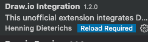

# 目录
    
       
<!-- TOC -->

- [目录](#目录)
    - [已完成](#已完成)
    - [当前计划](#当前计划)
    - [搁置计划](#搁置计划)
    - [一、开源项目](#一开源项目)
        - [1、软渲染器](#1软渲染器)
        - [2. FFMpeg入门教程](#2-ffmpeg入门教程)
            - [2.1 音视频基础知识入门](#21-音视频基础知识入门)
            - [2.3 FFMpeg入门](#23-ffmpeg入门)
        - [软渲染器渲染引擎（TODO）](#软渲染器渲染引擎todo)
        - [Opengl Glitter开源学习（TODO）](#opengl-glitter开源学习todo)
    - [二、其他](#二其他)
        - [Markdown写作](#markdown写作)
        - [我的互联网付费](#我的互联网付费)
    - [三、工具](#三工具)
        - [程序员工具账号](#程序员工具账号)
        - [VSCode插件和命令](#vscode插件和命令)
        - [Windows](#windows)
        - [mac](#mac)
        - [git](#git)
        - [adb](#adb)
        - [ffmpeg](#ffmpeg)
    - [四、思考](#四思考)
        - [与人交流](#与人交流)
        - [如何学习？](#如何学习)

<!-- /TOC -->

http://naotu.baidu.com/file/59a6fa3446a1b17ae96f1ec62560fa7d?token=cb4ca26ad9b4b980


## 已完成
|序号|计划名字|当前进度|资源链接|结论|
|-|-|-|-|-|
|1|《谷歌方法论》||[视频](https://www.igetget.com/course/%E7%A1%85%E8%B0%B7%E6%9D%A5%E4%BF%A1%C2%B2%C2%B7%E8%B0%B7%E6%AD%8C%E6%96%B9%E6%B3%95%E8%AE%BA?param=kZ5hknT2fn9&token=1AZ5y8e6DLQwVn5SnKNYB0qMG7golO)||
|2|《垃圾回收的算法和实现》||[书籍 ](https://github.com/wlxklyh/book/blob/master/Book/ObjectC/Objective-C%E5%9F%BA%E7%A1%80%E6%95%99%E7%A8%8B.pdf)||
|3|《Objective-C基础教程》||[书籍 ](https://github.com/wlxklyh/book/blob/master/Book/ObjectC/Objective-C%E5%9F%BA%E7%A1%80%E6%95%99%E7%A8%8B.pdf)|
|4|《GAMES101》||[视频](https://www.bilibili.com/video/BV1X7411F744/?spm_id_from=333.788.recommend_more_video.0)|
|5|《大象无形》||[书籍](https://github.com/wlxklyh/awesome-gamedev)||目前看完第8章|
|6| 《CUDA教程》 ||[视频](https://www.bilibili.com/video/BV1kx411m7Fk?p=11)|后面的机器学习相关的没看|

## 当前计划
- **短期计划（优先级高）**

|序号|计划名字|当前进度|资源链接|结论|结束时间|
|-|-|-|-|-|-|
|1| 《GAMES202》 P4没看 P7 P8 P9没看 |||


- **长期计划（优先级中 书籍课程）：** 

|序号|计划名字|当前进度|资源链接|结论|
|-|-|-|-|-|
|1|《Shader入门精要》|||
|2|《LearnOpengl》|||
|3|复习《垃圾回收的算法和实现》|||
|5|《GAMES102》|||

- **其他计划**

|序号|计划名字|当前进度|资源链接|结论|
|-|-|-|-|-|
|1|多平台同步博客||[工具](https://www.wechatsync.com/#faq)|**后面考虑使用**同步助手 199元每年|
|2|Flutter For Android 安装与初体验||km|完成Android和iOS的hello world工程 [链接](https://github.com/wlxklyh/book/blob/master/Book/Flutter/Start/Main.md)|
|3|outlook学习怎么高效使用||无 需搜索|写文档|
|4|软渲染器开源项目整理 和 完成iOS工程||github |写文档|
|6|维护博客|||
|7|AOP||差写文档|
|8|技术群 和 技术资料||尝试抖音讲解|
|9|技术类的引流 和 非技术类的引流|||


## 搁置计划  

- **游戏开发相关的**  

|序号|计划名字|当前进度|资源链接|结论|
|-|-|-|-|-|

- **移动开发相关的**

|序号|计划名字|当前进度|资源链接|结论|
|-|-|-|-|-|
|1|《从0开发一款iOS App》||[付费视频](https://time.geekbang.org/course/detail/100025901-93482)|
|2|《Runoob——Swift 教程》||[博客教程](https://www.runoob.com/swift/swift-tutorial.html)|
|3|《ios开发进阶》||[pdf 已购](https://github.com/wlxklyh/book/blob/master/Book/ObjectC/%E3%80%8AiOS%E5%BC%80%E5%8F%91%E8%BF%9B%E9%98%B6%E3%80%8B%E5%94%90%E5%B7%A7_%E5%B8%A6%E4%B9%A6%E7%AD%BE%E7%9B%AE%E5%BD%95.pdf)|
|4|Opengl jni 改成调用android.opengl||https://github.com/wlxklyh/Ado_OpenGLES_3_0|重要性低|
|5|GPUImage、Grafika|||重要性低|
|6|airhockey 看learnopengles教程||[链接](https://www.learnopengles.com/developing-a-simple-game-of-air-hockey-using-c-and-opengl-es-2-for-android-ios-and-the-web/)|重要性低|
|7|《安卓开发高手》||[付费视频](https://time.geekbang.org/column/article/70602)|

## 一、开源项目
|序号|项目名字|简介|github链接|
|-|-|-|-|
|1|个人知识脉络|**记录了看过的书、开源的项目、计算机知识脉络。**| [](https://github.com/wlxklyh/book) [](https://github.com/wlxklyh/book)|
|2|各平台软渲染器|**零基础入门渲染管线（android开发者、ios开发者、Unity开发者、UE开发者）**|[](https://github.com/wlxklyh/SoftRenderer) [](https://github.com/wlxklyh/SoftRenderer)|
|3|FFMpeg入门教程|**零基础入门FFmpeg（懂C++即可，下载可运行）**|[](https://github.com/wlxklyh/FFMpegStudy) [](https://github.com/wlxklyh/FFMpegStudy)|


### 1、软渲染器 
**平台和语言：**

   

**介绍：**
程序员的三大浪漫，编译原理、图形学、操作系统，所以我也有一种情节，想去学图形学。然后我拿起图形学的书，看完了第一章 似懂非懂，然后书又沾灰了。过了一段时间工作上遇到渲染管线相关的问题，然后又开始去网上看博客，看完之后也是似懂非懂，你是否也有跟我一样的经历了？Opengl的接口背后是什么呢？渲染管线怎么用程序表达。于是我找到一个skywind3000的软渲染器，然后自己再实现一遍，这样之后对渲染管线的理解更加深刻了。
通过代码来了解渲染管线 不调用图形库，ado、ios、unity、unreal都可以运行 

    


|平台|语言|工程路径|效果|
|-|-|-|-|
| | |https://github.com/wlxklyh/SoftRenderer/tree/master/Ado||
| | |https://github.com/wlxklyh/SoftRenderer/tree/master/iOS||
| | |https://github.com/wlxklyh/SoftRenderer/tree/master/Unity||
| | |https://github.com/wlxklyh/SoftRenderer/tree/master/Unreal||

|平台|画布|
|-|-|
|安卓|ImageView 然后用Bitmap作为画布|
|iOS|UIImageView 然后UIImage作为画布 buff转UIImage|
|Unity|Image 然后Texture2D作为画布 pixel去设置Texture2D|
|Unreal|UImage 然后UTexture2D作为画布|

看下说明即可：
https://github.com/wlxklyh/SoftRenderer

### 2. FFMpeg入门教程
#### 2.1 音视频基础知识入门
https://github.com/wlxklyh/book/blob/master/interview/%E9%9F%B3%E8%A7%86%E9%A2%91%E6%B5%81/Main.md

#### 2.3 FFMpeg入门
https://github.com/wlxklyh/FFMpegStudy


### 软渲染器渲染引擎（TODO）

### Opengl Glitter开源学习（TODO）


## 二、其他
### Markdown写作

  
|名字|价格|编辑|图床|公众号|简书|知乎|掘金|CSND|博客园|SegmentFault|开源中国|慕课手记|头条|Spring4All|试用|
|-|-|-|-|-|-|-|-|-|-|-|-|-|-|-|-|
|openwrite|199/年|web登录编辑 简单的md支持|付费提供|×|√|√|√|√|√|√|√|√|√|√|付费才能用 因为免费版不能更新文章|
|微信同步助手|免费|web登录编辑 简单的md支持|无|√|√|√|√|√|√|√|×|×|√|×|有bug|
|写作助手|免费|下载安装|工具处理图床|×|√|√|√|√|√|√|√|×|×|×|要逐个平台发布 而且没有更新功能|


|账户|说明|
|-|-|
| SegmentFault | 微信 |
| CSDN | 微信 |
| 掘金 | 微信 |
| 博客园 | 微信 |
| 简书 | 微信 |
| 通用类 | 微信 |
| 知乎 | 微信 |
| 通用类 | 微信 |
| 开源中国 | 微信 |
| Spring4All | github |
| 今日头条 | 微信 |
| 通用类 | 微信 |
| 慕课手记 | 微信 |
| 微博 | 无 |


>个人简介：高级开发工程师，兴趣和领域（Unity、Unreal、cocos creator、安卓终端开发、ios终端开发、音视频开发、图形学），欢迎加W：wlxklyh 探讨问题。（欢迎star：https://github.com/wlxklyh/SoftRenderer）


### 我的互联网付费
|名字||
|-|-|
|1、极客时间|19元买了一门课|
|2、得到|198元谷歌方法论的课|
|3、梯子 http://ss.yunyunyun.top/auth/login|1282836127@qq.com P:Scut 客服Q:2206128889 https://dy.sublink.cyou/auth/register|


## 三、工具
### 程序员工具账号 
||说明|账户和密码|
|-|-|-|
|JetBrains | 可以看下QQ邮箱的邮件|wlxklyh linyanhou@qq.com S|
|Epic Games||wlxklyh2 1282836127@qq.com S|

### VSCode插件和命令

|名字|说明|备注|
|-|-|-|
|上传图片|ctrl（command）+ alt + u 图片上传图床并贴到当前md||
|上传图片|ctrl（command）+ alt + v 图片上传相对目录img并贴到当前md||
|Draw.io|新建.drawio后缀的文件 |  |
|paste Image|||
|Markdown TOC|解决换行问题:https://blog.csdn.net/u014171091/article/details/89629634|  |
|Shader Toy||  | 
|setting sync| 设置同步神器 command+shift+p 输入 sync download setting  https://www.cnblogs.com/lychee/p/11214032.html  ||
|PicGO| 图床工具https://blog.csdn.net/xxiaobaib/article/details/92801700  |  |
|snippet|ctrl+shift+p   输入命令snippet   然后看到wlxkllyhsnippet 然后在里面编辑 当然也可以新建一个  ||


### Windows

- 工具

|名字|说明|备注|
|-|-|-|
|PicGo |图床工具 pic-migrater是图床切换的插件 可以转换图床||
|snipaste|截图工具|https://www.snipaste.com/  |
|gifcam| gif录制|https://gifcam.softonic.cn/|
|yunyunyun|梯子|http://ss.yunyunyun.top/auth/login|
|Todo|备忘|linyanhou@qq.com |
|Quixel Brige|Unreal资源查找和导入的神器|https://quixel.com/bridge|
- MyWorkSpace
```cpp
1、微云目录

2、github
    book
    proj
        awesome-gamedev
        UnrealEngine
        pbrt-3
    other
```


### mac  

- 工具

|名字|说明|备注|
|-|-|-|
|homebrew|包管理库 brew切换源||


- 技巧

|名字|说明|备注|
|-|-|-|
|mac录音|mac录音 同时录制媒体和麦克风|https://www.zhihu.com/question/26032781  |
|mac多开|open -n /Applications/WeChat.app/Contents/MacOS/WeChat  ||
|mac|sudo spctl --master-disable  Mac软件权限问题||

- 目录 


### git  
|名字|说明|备注|
|-|-|-|
|astralapp|star管理工具|https://app.astralapp.com/dashboard|
|** /Intermediate/ * !**/Intermediate/ProjectFiles|忽略技巧|


### adb

|命令|说明|备注|
|-|-|-|
|adb shell dumpsys meminfo com.tencent.weishi|内存||
|adb shell dumpsys dropbox data_app_crash --print|内存||
|adb shell dumpsys dropbox --print|内存||


### ffmpeg

|命令|说明|备注|
|-|-|-|
|ffmpeg -i 1.mp4 -i 5.mp4 -lavfi psnr="stats_file=psnr.log" -f null -|psnr |
|ffmpeg -i test_20.mp4  -i test_20Record.mp4  -lavfi ssim="stats_file=ssim.log" -f null -|psnr |
|ffprobe url|获取信息||


## 四、思考

### 与人交流
1. ios app 和 游戏，重要的是买量和渠道 还有跟人多交流
2. 教育：课程 这个要积累多年  儿童教育
3. 插件付费
4. 搬运。

### 如何学习？
1. 思维导图思路记录关键词 一定要简介
2. 有道词典设置查过的单词进入单词本
3. 
