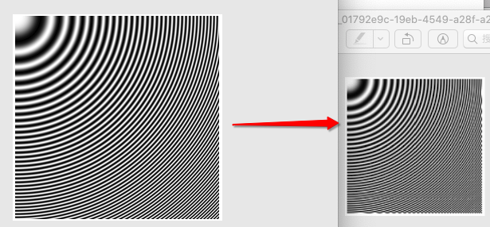
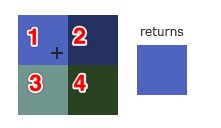
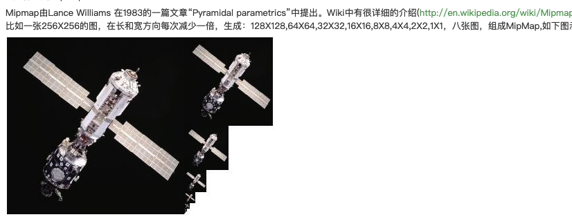
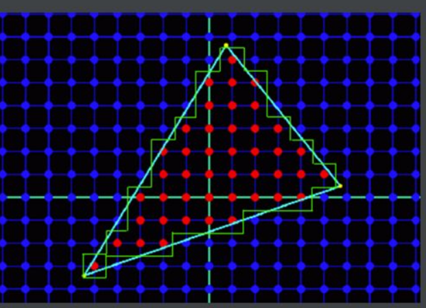
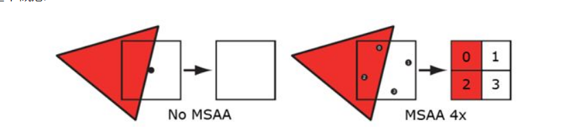

# 上采样的锯齿问题和下采样的叠乱问题

## 一、问题
问题起于纹理采样，所以先说下纹理采样是什么，下图的坐标是纹理（4个像素） 右边是屏幕（一个像素） 右边这个像素点要显示哪个纹理的像素呢？这个取纹理像素的过程就叫纹理采样。

### 1. 上样出现锯齿问题
左上角的图通过点采样放大4倍到右下角这张图，发现很多方块 这个就是锯齿问题。（区别于几何锯齿这里不详述）

### 2. 下采样出现叠乱（摩尔纹）
左图缩小采样到右边的图 出现波纹错乱 这个就是叠乱问题。

## 二、解决
其实就是采样方法 所以介绍下采样方法。

---------
下面是采样的过程 从纹理取像素 
### Nearest Point Sampling就近点采样
如图所示，右边示屏幕一个像素点，然后根据纹理坐标算到是第一个(0,0)这个像素 所以采样这个最近的像素  得到右边这个图

### Bilinear双线性采样
如图所示，右边示屏幕一个像素点，然后根据纹理坐标算到是第一个(0,0)这个像素 双线性的意思就是采样(0,0)(0,1)(1,0)(1,1)四个像素点的均值

### Trilinear三线性采样
三线性采样要先说下mipmap（摘录），下图就是mipmap：

对于下采样来说，就是找个小点的图来采样就不会有叠乱的问题。
三线性采样就是增加一个miplevel的纬度来采样  就是在miplevel=1的做双线性采样得到 color1 在miplevel=2的做双线性采样得到color2 然后两个取平均。

### 各向异性采样
就是说当这个纹理显示是一个正的平面是然后采样4个点（正方形）是可以的，但是当这个纹理是斜着摆放的时候 双线性采样就不是正方形  这四个点会做空间计算去采样。
左边是三线性采样，右边是各向异性采样。

---------
> 下面是画到画板上的过程，图形学来说就是光栅化中三角形设置的片元确定的过程
### SSAA （解决几何锯齿）
解决的是**几何画线**的锯齿  用一个更大的分辨率来渲染场景。

### MSAA
解决的是几何画线的锯齿

我们只对每个像素进行着色，但是并不意味着我们只需要存储一个颜色值，而是需要为每一个子采样点都存储颜色值，所以我们需要额外的空间来存储每个子采样点的颜色值。所以，颜色缓冲区的大小也为非MSAA下的n倍。

### 其他链接
https://en.wikipedia.org/wiki/Comparison_gallery_of_image_scaling_algorithms
bicubic interpolation 是什么
https://www.lihuasoft.net/article/show.php?id=4509
https://blog.csdn.net/puppet_master/article/details/50187291

## 引用
https://clouard.users.greyc.fr/Pantheon/experiments/rescaling/index-en.html
https://gameinstitute.qq.com/community/detail/115739
