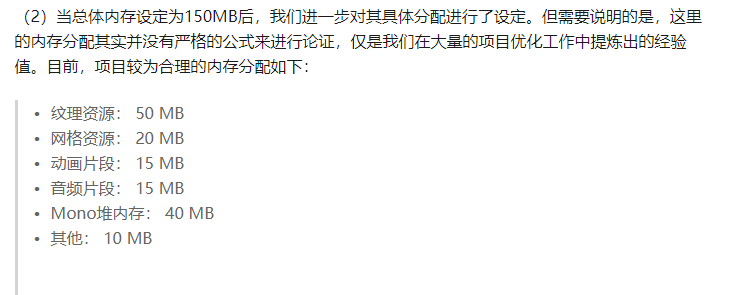

# android

## 1、生命周期
### Activity的生命周期
OnCreate
OnStart OnRestart
OnResume
OnPause
OnStop
OnDestroy

启动方式
Standard 每次都创建一个新实例
SingleTop （1）位于栈顶 复用栈顶 调用OnNewIntent （2）不在栈顶 跟Standard一样创建新的  （3）不在栈中 跟Standard一样
SingleTask 根据taskAffinity查找是否存在对应名字的任务栈 不存在则创建一个新的Task 入栈到Task  存在则上面的activity实例出栈 调用OnNewIntent
SingleInstance 具备SingleTask特性 

### Service生命周期
StartService 启动服务
StopService 关闭服务
BindService
UnBindService

OnCreate
OnStartCommand
OnDestroy
OnBind
OnUnBind

## 2、四大组件
activity
service  音乐播放器
broadcastReceiver  广播接收器
contentprovider 进程通信 数据交互

## 3、内存分析
1、数据来源
（1）外网数据
（2）实时内存显示
（3）工具 unity、xcode、prefdog

2、内存分类
App分类：
Pss 

游戏分类
Unity资源
mono:游戏的数据
各种SDK：几十上百M

3、工具
（1）unity profile:可以看到 Unity、mono、显存、 
（2）xcode:
只关心存活的Created & Persistent  
1、启动后看下sdk内存几十M（健康数据、腾讯地图等等） 对SDK做开关控制 和 日志打印
2、游戏配置数据 用了C#的数据结构  配置全加载在C#内存占用有10多M  C#容器是有额外消耗 自己写数据结构 配置数据不用插入 所以用有序数组 二分查找这样来做 节省4M
3、资源索引从string改成md5

4、方法论：
（1）优先看资源大头、纹理格式、bundle格式、大图资源
（2）unity特有的资源  bundle处理
（3）mono，mono内存由于unity会有内存池 内存泄露的问题工具暴露不出来 那么就在内存池的申请释放接口额外申请释放内存 这样来工具就可以跟踪了
工具可以看到
（4）个人统计 天天炫斗的时候 分类：纹理、db、

## 4、项目
AssetBundle是将资源使用Unity提供的一种用于存储资源的压缩格式打包后的集合，它可以存储任何一种Unity可以识别的资源，如模型，纹理图，音频，场景等资源。
这个bunlde的使用路径是 构建分包 更新下载 本地加载卸载管理

## 5、Qzone热更新原理
classloader会双亲委托 最终是有个dex列表 前面的先加载  热更就是把新的dex插入到最前面
问题1：class调用关系在一个dex里面 会标记CLASS_ISPREVERIFIED 后面如果到新的dex 则会异常
解决：构造函数调用一个XXX.dex的XXX类  然后这样就不会被标记CLASS_ISPREVERIFIED

问题2：流程
1. 获取当前应用的ClassLoader 即为BaseDexClassloader
2. 反射获取DexPathList pathlist
3. 反射获取pathList 的dexElements方法 把path.dex转成Element[]
4. 合并两个Element[] path.dex放到最前面

## 6、Tinker热更新原理
