## MVVM

### 目标

- **做好View和Model的单元测试，View做的是便捷自测**
- **解耦现在的Form Module 可以做到Form和Module的分开协作。**
- **上面两条的一个前提是：View和Model 彻底隔离。**

### 零、目前Gwgo
我们目前是MV(C)模式跟炫斗的模式类似，也是一些安卓应用之前常见的模式，View和controller放在一个逻辑单元，也有部分地方用了MVC的逻辑。

#### 1、MV(C)
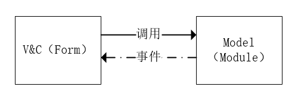

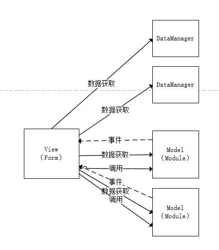
另外一种理解，**把prefab组织结构理解为view** ,没有操控能力的View
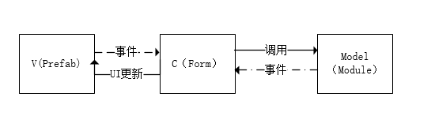
#### 2、MVC gwgo的猫基因等用到
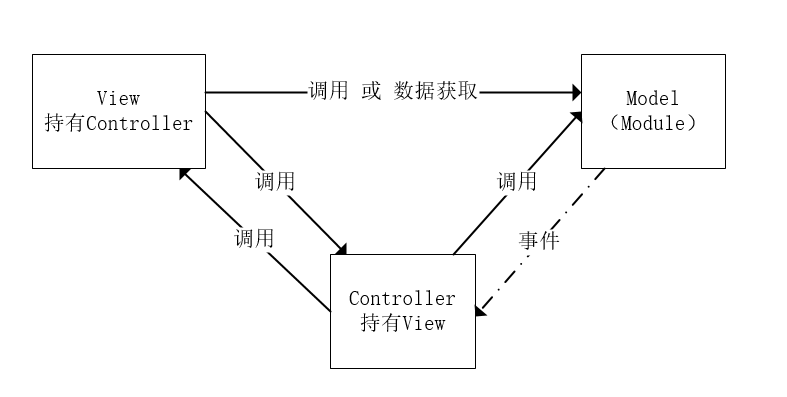

（1）写着写着容易View里面加了很多Controller的东西 因为这样快捷 符合编程的习惯。
（2）View依赖Model 不能做单元测试

### 一、XX项目
我理解为MC或者是MVVM 都可以。
是MV(C)的优化：
1、优化了Model :M是Model、Model Ctrl、Model Mgr的逻辑
2、优化了绑定，自动绑定UI，但不是数据绑定。V和C还是在一起，V和C用了ViewBind去自动生成绑定。

单元测试：不能做单元测试 View 里面有Ctrl且有调用Model(Mgr)的逻辑 无法解耦做单元测试
分工协作：可以分出View的人出来  但是还是有Mgr和Model的逻辑

**如果是这样理解也可以说是MVVM的** 但是Panel中有ViewCtrl的UI逻辑在 V是自动生成的代码了

### 二、XX2项目
Databinding+Event系统
优势：1、重播 2、databinding可以做一些UI操作的合并
缺点：写代码跳来跳去
框架
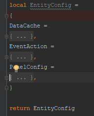

框架的特点不是MVC、MVVM等设计模式的解耦而是
1、事件驱动或者叫command驱动  可以重放
2、databinding(代码里面自己手动写binding)

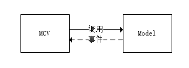

**这样理解也是MVVM的**
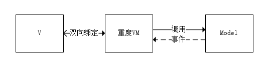

### 三、MVP  后面P会臃肿  
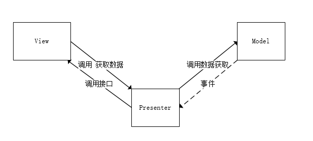

### 四、设计模式只是思路 重点是我们要什么 不要什么

我们要：（1）可以分工协作 （2）可以单元测试 独立测试
我们不要：增加程序的负担

#### 思路：
1、做到View的独立自测， 然后View就可以分出去做
2、做到Model的逻辑单元测试。
3、总体就是要切断View和Model的耦合。

#### 方案一 MVP、事件+数据来驱动View 

**一句话描述：** 把现在的Form的逻辑的数据接口 变成事件+数据驱动。

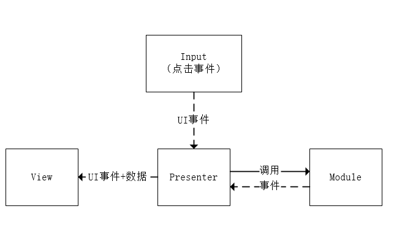
1、View给一个人写，里面有一些ViewCtrl的逻辑,M和P给另外一个人写。
2、M做单元测试 V做自测
流程：
1. 写M和P的人 制定事件 制定View的单元测试事件 View是测试驱动的。
2. 写View的人去写事件驱动的接口，顺着测试事件写。

举例：
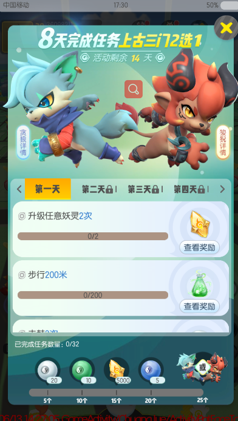

1. 写M和P的人： 
    1. 制定事件：
        1. InitPanel事件: 要带上（8天每天的任务列表+任务个数奖励列表）
        2. 领奖刷新事件：要带上（此次领奖的结果）
        3. 同时制定测试用例：先发InitPanel事件 然后发领奖刷新事件
    2. 写P的控制逻辑：
        1. P有Onopen响应逻辑 收到之后要去获取初始数据 然后发送Init panel事件
        2. P有点击事件的响应 收到响应区服务器请求 然后收到回包发领奖刷新事件

2. 写V的人：
    1. 写InitPanel事件的响应逻辑
    2. 写领奖刷新事件的响应逻辑   
    3. 自测测试用例 

#### 方案二 强Databinding 做到协作 MVVM

**一句话描述：** 把现在的Form的UI显示逻辑抽成binding的逻辑，只处理数据变更的对应的UI变更。
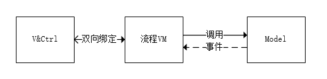
View的人来写data结构，写VM和M的人来操控data。
例如：8天御灵活动

1. View的人可能会定义：
    1. 天状态的列表表示每天的状态。
    2. 二维数组表示内容部分的 每天的任务状态
    3. 完成任务数量的列表

View的人自测，自己填充数据去写。

2. 写VM的人来改变这些data.
等view的人写完 再来做。
操控data的人要去翻译数据到自定义data

||方案一|方案二|
|--|--|--|
|设计模式|MVP|MVVM|
|分工|View重度、PM|View轻度、VM(流程控制) M|
|优点|View可以做回放 View做自测|View做自测|
|缺点|需求添加两人协作少一些|需求添加需要两人协作多点|
|缺点|写View的人稍微复杂点|写View的人逻辑特别简单 甚至是可以工具去绑定（人控制工具）|

问题：
1、V 和 M的人 是1：n 则选择方案二 V 和 M的人是n：1、1：1则选择方案一  所以问下分工的倾向。
2、

### 感悟
定制框架后，会有条条框框的约束，习惯性会面向过程编程，导致逻辑单元会又写在一个地方。导致逻辑和视图控制耦合。框架要求，一些框架的代码尽量可以生成，并且最好可以监控，明确框架带来的收益，明确遵守约束的好处