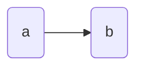

# 播放起性能优化学习

学习资料来源：https://mp.weixin.qq.com/s/VnuCHsoMVsuKSYqGTsOnyw

播放器的流程：

> 1. 给一个网络url 首先进行网络请求 网络如何优化 涉及到网络优化的方方面面
> 2. 网络数据拉回来之后 识别下当前视频的具体封装格式 
> 3. 解析格式 解析音频流 视频流 解码成原始数据 PCM YUV这些
> 4. 音视频同步 音频播放 视频渲染

## 1、播放痛点
- 播放失败率高
- 播放首帧慢
- 播放卡顿
- 播放视频消耗资源

面对这些问题 我们急切需要做的步骤是：
1. 监控这些问题 
2. 解决这些问题

## 2、监控手段
如果我们直接埋头进去优化 会一头雾水，需要先收集数据进行分析。
（1）网络夹在监控
播放视频首要的是网络加载  可以监控如下的链路：

